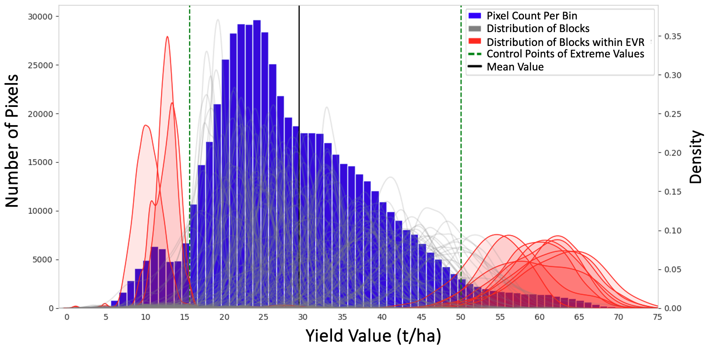
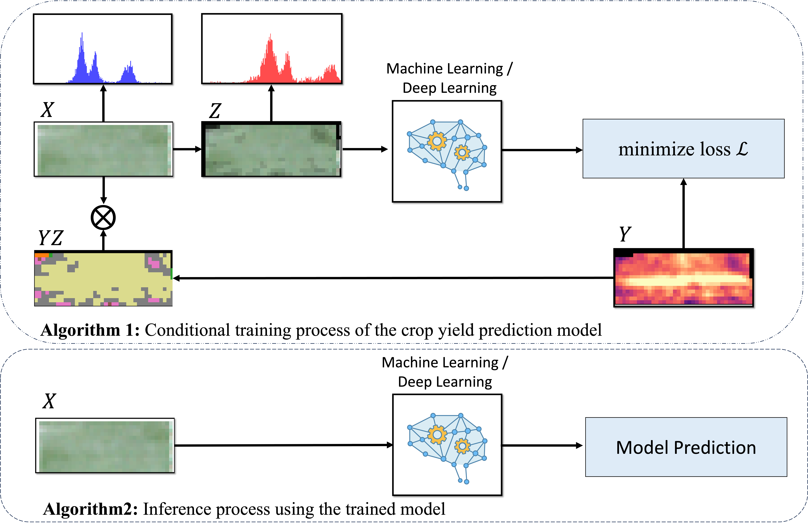
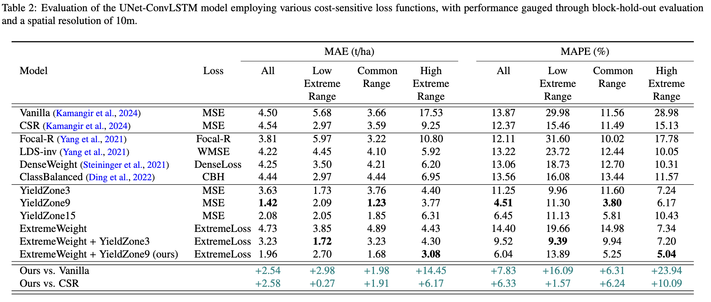
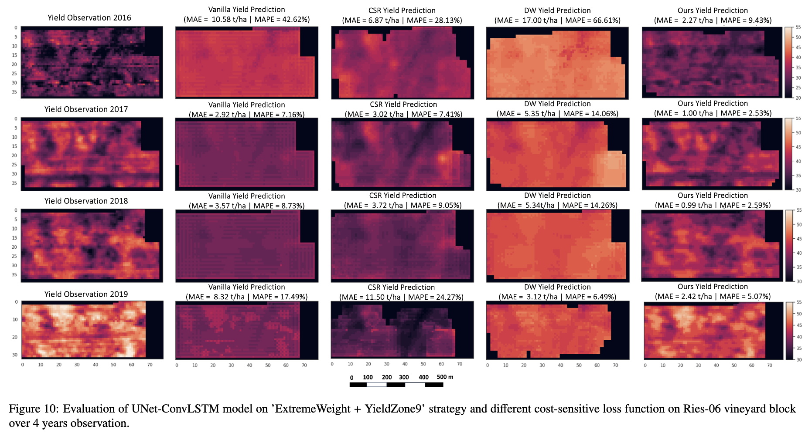

# Predicting Crop Yield Lows Through Highs via Binned Deep Imbalanced Regression

## Overview

This repository contains the code and resources for predicting crop yield extremes via binned deep imbalanced regression. The project focuses on addressing challenges in regression with highly imbalanced data, a common issue in agricultural applications.  

Accurate crop yield estimation is critical for effective agricultural management and decision-making. However, predicting extreme yield values remains particularly challenging due to their rarity and disproportionate impact on operations and markets. Traditional models often struggle to handle these extremes, leading to biased predictions and reduced accuracy.  
  


To tackle this problem, our study introduces two key innovations:  

1. **ExtremeLoss**: A novel cost-sensitive loss function designed to better capture and represent less frequent data points, ensuring a focus on extreme values without compromising overall performance. 
The ExtremeWeight function is defined as:

\[
f_{\text{ExtremeWeight}} = \alpha (y - \bar{y})^2 + 1
\]

where:
- \( y \) is the observed yield,
- \( \bar{y} \) is the mean yield,
- \( \alpha \) is a scaling factor as inverse of normalized density for each sample.

2. **Conditional Deep Learning Model**: This model incorporates a binned yield observation map as a conditioning factor during training, enabling enhanced feature representation and improved predictive accuracy for rare yield scenarios.  
Our approach demonstrates significant improvements over traditional methods, particularly in accurately predicting low-frequency, high-impact yield values. 

  

## Features
- A versatile conditional training approach that enhances input feature maps by leveraging similarity within distinct yield zones, adaptable to a range of deep learning architectures.
- A new cost-sensitive loss function designed to address imbalanced regression in yield estimation tasks. 
- An extensive comparative analysis between previously established methods including Dense Weighting (DW), Local Density Smoothing (LDS), and Class Balancing (CB) and the current approach for tackling imbalanced regression in vineyard yield estimation.
  


- A detailed analysis of the proposed deep imbalanced regression model, emphasizing its enhanced capability to interpret extreme yield values and spatial variability.  
 

## Requirements

Before running the code, ensure you have the following dependencies installed:

- Python 3.11
- PyTorch > 2.0
- NumPy
- Pandas
- Matplotlib
- Seaborn (for visualization)


```bash
python train.py --exp_name my_experiment --batch_size 64 --in_channels 4 --dropout 0.1 --ldsks 10 --ldssigma 8 --alphs 3.9 --betha 4 --lr 0.0001 --wd 0.0001 --epochs 50 --loss mse --reweight dw


